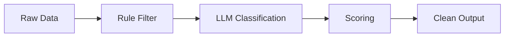

# 🧠 LLM-Based Noise Filtering System

## 📖 Description

An intelligent filtering system that removes noisy and irrelevant data from logs using a hybrid approach combining rule-based filtering and Large Language Models (LLMs).

The project simulates a real-world AI pipeline used in cybersecurity and data processing systems, focusing on extracting meaningful information from large volumes of unstructured data.

---

## 🎯 Goals

- Reduce noise in logs and text data
- Identify relevant security-related information
- Build a real-world AI pipeline
- Evaluate system performance using manual labeling

---

## ⚙️ Tech Stack

- Python
- Regular Expressions (Regex)
- LLM APIs (OpenAI or open-source models)
- JSON / Text Processing

---

## 🧠 Key Concepts

- Data preprocessing
- Hybrid systems (rules + AI)
- Prompt engineering
- Pipeline architecture
- AI evaluation (accuracy, testing)

---

## 🏗️ Architecture



---

## 🚀 Features

- Rule-based noise filtering
- LLM-powered relevance classification
- Scoring system for decision making
- Modular pipeline design
- Easy to extend and integrate

---

## 📂 Project Structure

```text
project/
|
|-- main.py      # Pipeline execution
|-- regex_filter.py    # Rule-based filtering
|-- llm_classifier.py       # AI classification
|-- utils.py     # Helper functions
|-- data/        # Sample logs
`-- README.md
```

---

## 🧪 Usage

### Example Input

```text
DEBUG connection reset
User login successful
SQL injection detected
```

### Example Output

```text
User login successful
SQL injection detected
```

---

## 📊 Evaluation

The system is evaluated using a manually labeled dataset:

- Each log is labeled as **Relevant** or **Noise**
- Model predictions are compared against ground truth

### Accuracy Formula

```text
accuracy = correct_predictions / total_samples
```

This ensures reliable performance and helps improve prompt design.

---

## 🔮 Future Improvements

- Add API with FastAPI
- Improve scoring logic
- Support real-time log streams
- Optimize LLM usage (cost + speed)
- Integrate with security tools

---

## 📚 Learning Purpose

This project is designed to understand how modern AI systems work by combining:

- rule-based logic
- machine intelligence
- structured pipelines

---

## 🤝 Contributing

Contributions, ideas, and feedback are welcome!  
Feel free to open issues or submit pull requests.

---

## 📌 Author

**Maintainer**: Yasseene  
**GitHub**: [@mUchiha26](https://github.com/mUchiha26)
